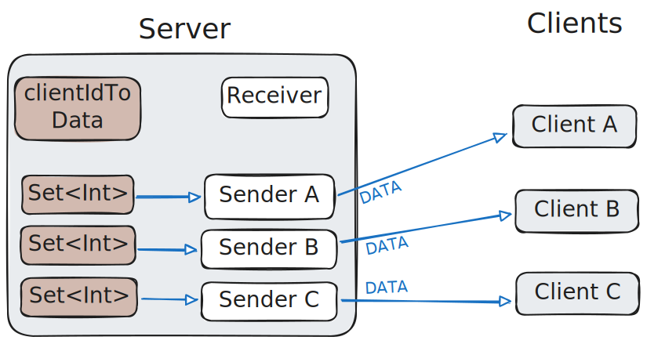
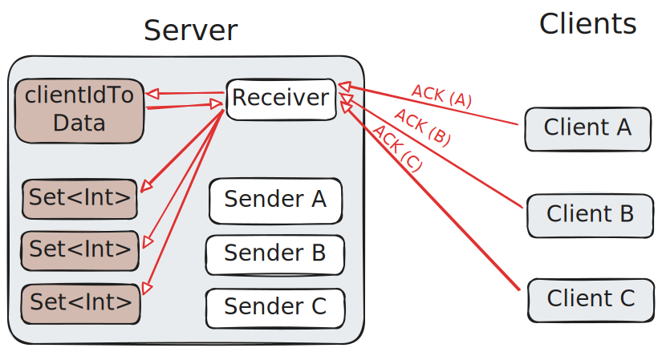

# Packet Loss Recovery Algorithm

Brushing up on my knowledge of TCP by implementing sequence numbers and ACK responses over UDP.

Begin by splitting data into chunks. Each chunk gets an index called a sequence number.

```
The Transm ission Con trol Proto col (TCP)  is one of  
|--------| |--------| |--------| |--------| |--------| 
    00         01         02         03         04    

the main p rotocols o f the Inte rnet proto col suite.
|--------| |--------| |--------| |--------| |--------|
    05         06         07         08         09
```

Each client gets a dedicated sender thread which sends the chunks, not necessarily in order.




The clients all send their ACK packets to the single receiver thread, which identifies the clients and keeps track of which chunks they have ACKed in a thread-safe data structure per client.



The server has **one receiver thread** which receives ACKs from the clients. It writes the sequence numbers to thread-safe sets. There are dedicated **per-client sender threads** which send the data not yet ACKed, and sleep before re-attempting.

Note that because we use virtual threads, sleeping threads won't schedule busy waiting instructions like OS threads would.

This is an example of server logs with two sender threads and one receiver thread.

```
Packet-Loss-Recovery $ make run-server
javac -d build Server.java
java -cp build Server
|RECEIVER| Sender spawned for /127.0.0.1:43701
|SENDER /127.0.0.1:43701| Sent sequence numbers [0, 1, 2, 3, 4, 5, 6]
|RECEIVER| Client /127.0.0.1:43701 ACKs 0
|RECEIVER| Client /127.0.0.1:43701 ACKs 1
|RECEIVER| Client /127.0.0.1:43701 ACKs 4
|RECEIVER| Client /127.0.0.1:43701 ACKs 6
|RECEIVER| Sender spawned for /127.0.0.1:37965
|SENDER /127.0.0.1:37965| Sent sequence numbers [0, 1, 2, 3, 4, 5, 6]
|RECEIVER| Client /127.0.0.1:37965 ACKs 2
|RECEIVER| Client /127.0.0.1:37965 ACKs 3
|RECEIVER| Client /127.0.0.1:37965 ACKs 5
|SENDER /127.0.0.1:43701| Sent sequence numbers [2, 3, 5]
|RECEIVER| Client /127.0.0.1:43701 ACKs 2
|RECEIVER| Client /127.0.0.1:43701 ACKs 3
|RECEIVER| Client /127.0.0.1:43701 ACKs 5
|SENDER /127.0.0.1:37965| Sent sequence numbers [0, 1, 4, 6]
|RECEIVER| Client /127.0.0.1:37965 ACKs 0
|RECEIVER| Client /127.0.0.1:37965 ACKs 1
|RECEIVER| Client /127.0.0.1:37965 ACKs 6
|SENDER /127.0.0.1:43701| Sent FIN packet
|SENDER /127.0.0.1:37965| Sent sequence numbers [4]
|SENDER /127.0.0.1:37965| Sent sequence numbers [4]
|SENDER /127.0.0.1:37965| Sent sequence numbers [4]
|RECEIVER| Client /127.0.0.1:37965 ACKs 4
|SENDER /127.0.0.1:37965| Sent FIN packet
```
