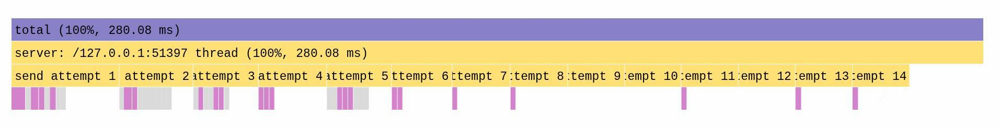

# Packet Loss Recovery Algorithm

Brushing up on my knowledge of TCP by implementing sequence numbers and ACK responses over UDP. Also learned about dependency injection with Dagger and distributed traces with OpenTelemetry along the way.

Begin by splitting data into chunks. Each chunk gets an index called a sequence number.

```
The Transm ission Con trol Proto col (TCP)  is one of  
|--------| |--------| |--------| |--------| |--------| 
    00         01         02         03         04    

the main p rotocols o f the Inte rnet proto col suite.
|--------| |--------| |--------| |--------| |--------|
    05         06         07         08         09
```

Each client gets a dedicated sender thread which sends the chunks, not necessarily in order. The sender threads will then sleep for 1 second before repeating.


The clients all send their ACK packets to the single receiver thread, which identifies the clients and keeps track of which chunks they have ACKed in a thread-safe data structure per client.


Note that because we use **virtual threads,** sleeping threads won't schedule busy waiting instructions like OS threads would.

I've also used OpenTelemetry to measure distributed traces. This flame graph shows a trace of the lifespan of one client. The yellow spans are from the server and the pink spans are from the client.



Note that a 1ms sleep was added into the client ACKs so that they would be visible in the graph. This extra sleep has been left in so anybody reading can replicate the results.

### Running the code

You will need Java, Gradle and Docker. First, start the OpenTelemetry backend collector Jaeger using `./start_jaeger.sh`. Next, run the code with `gradle run --args="server"` and `gradle run --args="client"`. You will be able to view the traces at http://localhost:16686.

