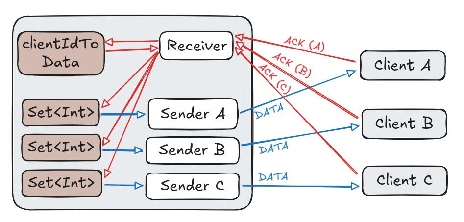

# Packet Loss Recovery Algorithm

Brushing up on my knowledge of TCP by implementing sequence numbers and ACK responses over UDP.

Implementation is half-duplex and one-way (client downloads from server only) without the three-way handshake in the beginning.

## What it does

Begin by splitting data into chunks. Each chunk gets an index called a sequence number.

```
The Transm ission Con trol Proto col (TCP)  is one of  
|--------| |--------| |--------| |--------| |--------| 
    00         01         02         03         04    

the main p rotocols o f the Inte rnet proto col suite.
|--------| |--------| |--------| |--------| |--------|
    05         06         07         08         09
```

TODO: show server and client logs, and the final output

## Architecture



Here is also a really bad attempt at an ASCII version. I will try to make it better

```
 Server                                                   Client A                       
+------------------------------------------+             +------------------------------+
| +--------------+            +----------+ |             | +----------+   +-----------+ |
| | (hashmap)    +--.get()--->| (thread) |<+-ACK,A-------+-+ (thread) |   | (hashmap) | |
| | Client Data  |        +---+ Receiver |<+-ACK,B-----+ | | Receiver +-->| message   | |
| |              |        |+--+          | |        +--+-+>|          |   |           | |
| +--------------+        ||  +----------+ |        |  | | +----------+   +-----------+ |
|                         ||               |        |  | +------------------------------+
| +--------------+        ||  +----------+ |        |  |                                 
| | (bool array) |<-.put()+|  | (thread) +-+-DATA---+  |  Client B                       
| | ACKs from A  +--.get()-+->| Sender A | |           | +------------------------------+
| |              |         |  |          | |           | | +----------+   +-----------+ |
| +--------------+         |  +----------+ |           +-+-+ (thread) |   | (hashmap) | |
| +--------------+         |  +----------+ |             | | Receiver |-->| message   | |
| | (bool array) |         |  | (thread) | |        +----+>|          |   |           | |
| | ACKs from B  |<-.put()-+  | Sender B +-+-DATA---+    | +----------+   +-----------+ |
| |              +--.get()--->|          | |             +------------------------------+
| +--------------+            +----------+ |                                             
+------------------------------------------+                                             
```

TODO: explain design
